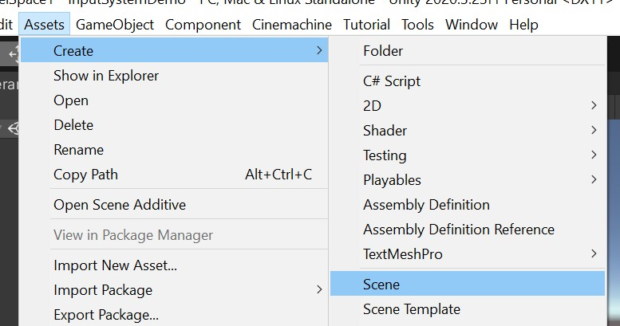
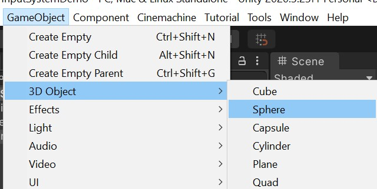
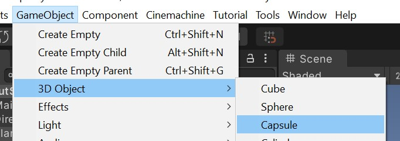
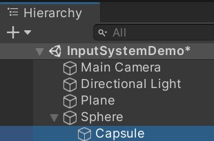
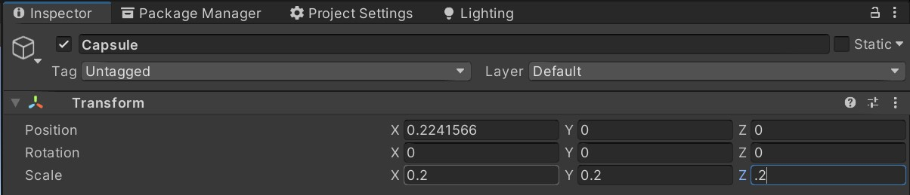
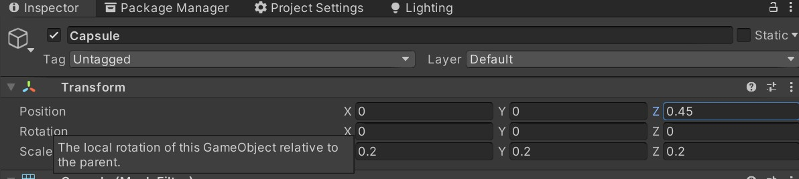
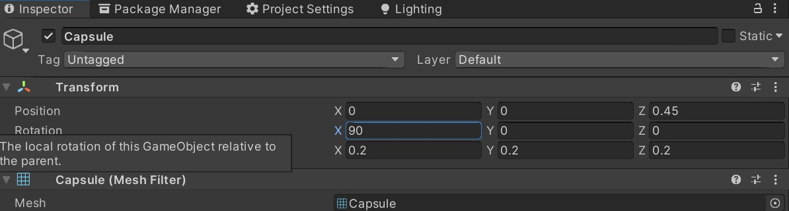
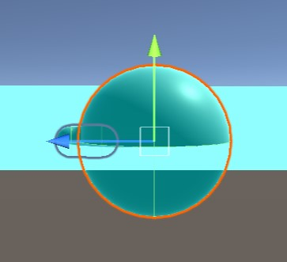
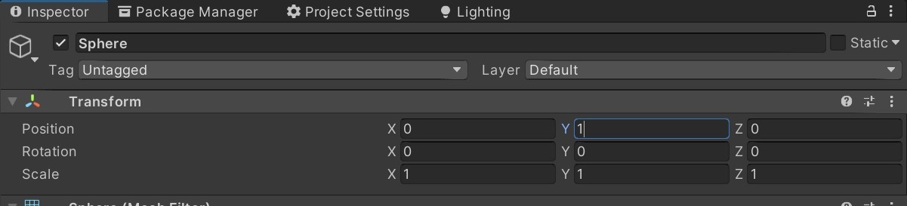
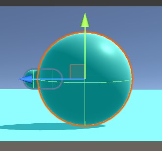

# Make a Fresh Scene and Character

You need a scene and character so you can see input making
something move. You have many options but this page
provides instructions for creating your own scene and character,
which can be a good exercise if you're newer to Unity.

We will create a simple character in a blank scene

## 1-1 Create a simple scene

The scene and character just needs to be enough to see movement
working.

### 1-1-1: Create new scene

Go to menu Assets | Create | Scene.

### 1-1-2: Rename new scene file

Then give your new scene file a name in the Project panel.
The file will appear in the current folder in the `Project` panel.
It's a good idea to have a folder called `Scenes` and put your
scenes there.

Rename "New Scene" to better indicate what your scene is about.
For this one it could be "Simple Input."

## 1-2 Create ground and character

Add a plane as a very simple ground. We won't worry about applying
materials, so this will be a very nice and boring white.

### 1-2-1 Create 3D Object | Plane

Use the `GameObject` menu to create a plane.
Click: GameObject | 3D Object | Plane

### 1-2-2 Set position to 0, 0, 0

Use the Inspector panel to see the properties of the plane.
If you cannot vind the Inspector, then use the Window menu
to open it.

Edit position to be 0, 0, 0.

### 1-2-3 Create simple character objects

Our character will have a Sphere body and a capsule for a nose.
The sphere will be the root game object and the capsule will be a child of the sphere.

Use menu: GameObject | 3D Object | Sphere

Use menu: GameObject | 3D Object | Capsule

### 1-2-4 Make capsule into a nose.

In the `Hierarchy` panel, drag the *Capsule* object into the
*Sphere* object so it becomes a child.

With the *Capsule* still selected in the Hierarchy,
go to the inspector and change the scale to 0.2, 0.2, 0.2
so that the capsule is one-fifth the size of the sphere.

Because the capsule is a child of the sphere, any position
entered in the Inspector will move the capsule RELATIVE to the 
sphere.

Make the capsule poke out of the sphere, that has radius 1,
in the positive Z direction, so it becomes a nose.

In the inspector, set the position to: 0, 0, 0.45

We need to rotate the capsule so it looks like a nose.
In the inspector, change the rotation to: 90, 0, 0
This rotates the capsule 90 degrees in the X axis.

Almost done, now...

At this point, the sphere will have a random position and may
be part submerged in the plane. We should see the capsule
poking out in the positive direction of the Z axis, indicated
by the blue arrow in the Scene View.

**The final step** is to move the sphere up so its bottom
rests on the plane.

1. Select the Sphere in the Hierarchy panel.
2. Edit `position` in the Inspector to be: 0, 1, 0

And now the sphere is ready to be a character and the nose shows the direction where it will go.

