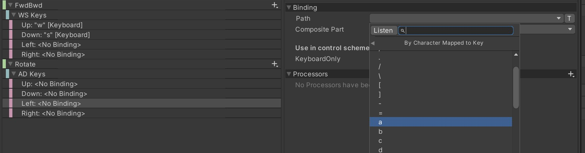
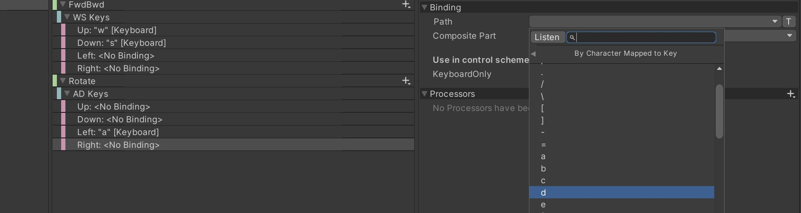
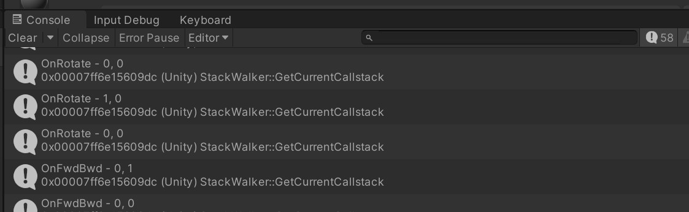

# Create a Controller

The code for this will be in the src folder. Snippets will be shown
here for clarity but seeing the whole source files puts it into
perspective.

The source for this file is in the folder called
 `03-create-a-controller` so feel free to open them up in
 your favourite editor.

The code in this example uses the **C# events approach** that is
only one of a number of approahes possible with the Input System.
It is probably the simplest and likely to be the most favoured one.

What follows is long and detailed, so get your coffee or preferred brew
and be ready to follow along. This is the quick start that Unity should
have given....

## Code Design

This will be done in two parts - one will be the input processing
component that receives input events and determining a change
in motion speed or rotational speed from that.

Another component will be the actual character controller and
will refer to the input processing component motion and rotation
changes and perform the movement, accordingly.

Splitting it up makes it easier to debug and try new things.

## Getting Input

### 1. Add a new C# file

In the `Project` window, right click on a folder, usually "script" or "code", and click **Create C# Script**.
I named it `MotionInput` - Unity creates `MotionInput.cs` in the chosen folder.

***NOTE***: the classname **MUST** match the filename for Unity to use it correctly.

```csharp
using System.Collections;
using System.Collections.Generic;
using UnityEngine;

public class MotionInput : MonoBehaviour
{
    // Start is called before the first frame update
    void Start()
    {
        
    }

    // Update is called once per frame
    void Update()
    {
        
    }
}
``` 

### 2. Add Support for the Input System

Add a new using statement for the Input System at the 4th line and add an `AddComponentMenu` attribute to make it easier to add the
 component to the Character GameObject later.

```c#
using UnityEngine.InputSystem;


[AddComponentMenu("InputExample/"+nameof(MotionInput))]
public class MotionInput : MonoBehaviour
```

### 3. Set it up for some input.

We will create an input system for WASD keys.
So we will create a method called `FwdBwd` to receive 
forward/backward events

| Keys        | Mapping               |Event Method | Action |
|-------------|-----------------------|-------------|--------|
| `W` and `S` | forward and backward  | OnFwdBwd    | FwdBwd |
| `A` and `D` |  left, right rotation.| OnRotate    | Rotate |

We will add a require component attribute to ensure
the `PlayerInput` component is attached, and the start
of the class declaration looks like this:

I remove the `Update()` method because we don't need it.
And we add our methods so the input shows in the Inspector.

Now it looks like this:

```c#
using System.Collections;
using System.Collections.Generic;
using UnityEngine;
using UnityEngine.InputSystem;

[AddComponentMenu("InputExample/"+nameof(MotionInput))]
[RequireComponent(typeof(PlayerInput))]
public class MotionInput : MonoBehaviour
{
    [Header("Debug Visibility")]
    public Vector2 _ForwardBackward;
    public Vector2 _AngularRotation;

    // Start is called before the first frame update
    void Start()
    {
        
    }

    void OnFwdBwd(InputValue input)
    {
        _ForwardBackward = input.Get<Vector2>();
    }

    void OnRotate(InputValue input)
    {
        _AngularRotation = input.Get<Vector2>();
    }
}
```

### A note on defining ActionMap and Actions

The Input Action asset is defined and edited with a special
window that opens by double-clicking on the asset in the Project
window or by clicking "Edit asset" in the Inspector window
when the asset is selected.

-----------------------------

**Input Asset editor Window has Three panes**

| Left Pane         | Middle Pane | Right Pane |
|-------------------|-------------|------------|
| ActionMaps        | Actions & bindings | Properties |
| Usually one entry | Many bindings | Contextual properties based on action or binding selected. |

-----------------------------

We will create an action map where all Actions will
go for our player. At this stage, I haven't figured out
why I might have
more than one ActionMap, but it might be for UI input.

The Actions (middle panel) are where our event handling
methods in C# need to correspond to the names in the 
Input Action.

We will see this as we go.

-----------------------------

### 4. Create InputActions asset

Right click on the folder where you want to create the asset


Then I name it `ForwardBackwardAndRotate`

Double-click on the asset in the `Project` window to edit the 
asset and create actions.

-----------------------------

### 4.1 Create a control scheme

On the top-left of the new panel for the InputAction,
click on the drop-down where it says "No Control Schemes" and
choose Add Control Scheme...


I called my new scheme `KeyboardOnly`


Then hit the `+` plus sign to add a required input device.


and then click `Save`

We will look at adding other device types on a different page, later.

-----------------------------


### 4.2 Create FwdBwd Action

Click on the **+** in the left pane "ActionMaps" and call the new
ActionMap "PlayerActions"


-----------------------------

### 4.3 Define FwdBwd Action

Creating the ActionMap leaves you with an initial Action,
called `New action` and a basic set of properties in the right panel.

Give the new Action the name `FwdBwd` exactly and that
will mean input will trigger the `OnFwdBwd(..)` method in our code.
**This is where names matter!**

Right-click on "New action," select Rename and call it "FwdBwd"


-----------------------------

### 4.4 Configure FwdBwd action as Vector2 Input

This bit is a little confusing, I had to practice this a few times
over to understand how the "Properties" panel was working. It shows
the properties of the Action that is selected.

Thera are two steps here:
1. Change the Property "Action Type" from "Button" to Value. This makes a new property appear - "Control Type"


2. Set "Control Type" to "Vector 2"


Finally, when you select "FwdBwd" Action in the centre, Actions
pane, we should see the properties as below:


-----------------------------

#### 4.5 Make an UP input binding for FwdBwd

Now our action needs some bindings of input triggers to the action.

You may notice that the Action "FwdBwd" has a > arrow
indicating that there is a list of sub-items that can be expanded
or collapsed. By default, the asset editor will create 
a silly, empty input binding that has the original (Button)
config and cannot be made to work.

So there are two steps to getting a useful Up binding:

1. Expand the list, so you can see all the bindings


2. Delete the silly, default binding - right click and Delete


3. Add a new binding for keyboard with Vector2 input

Click on the **+** pull-down menu at the right end of the row where
`FwdBwd` Action - it has a `+` sign and a pull-down menu chevron.
Select "Add 2D Composite Binding" from that menu and then give
the binding the name "WD Keys."


4. Define Up binding key

Click on `Up:<No Binding>` and change the Path property to select 
the keyboard character for Up.

Sometimes, Clicking on Path shows you "Usages" and you need
to navigate to keyboard before choosing the key binding. This path
concept could get more complicated with more input devices.
Because this is the first binding for this action, there is
more work, the second one should be easier.


Click the `<` left arrow on the same line as Usages to go back
and select Keyboard.


And now choose `w` key....


When done correctly, we see the `FwdBwd` Action has a `WD Keys`
composite with Up bound to "w" from keyboard, like this:


-----------------------------

### 4.6 Set the Down binding

Click on the `Down: <No Binding>` item, click on Path
in the Properties tab and now it should show keyboard
key options.


Now the `FwdBwd` action should have a WD Keys composite with
2 configured bindings and 2 undefined - this is as-designed.


-----------------------------

### 4.7 Test that Input events are received.

Now we go back to our component that we wrote at the start and
add some debug lines we can confirm that the input is being
received and passed to the event handler.

By adding this debug line - we should easily see entries appear
in the **Console** window and also see the `ForwardBackward` values in the
Inspector window if we have the Character game object selected.

```c#
  void OnFwdBwd(InputValue input)
  {
      _ForwardBackward = input.Get<Vector2>();
      Debug.Log($"OnFwdBwd - {_ForwardBackward.x}, {_ForwardBackward.y}"); // NEW DEBUG !!
  }
```

Before we test, we need to make sure the **PlayerInput** component on our Character
is configured to use the InputAction asset.

1. Add the MotionInput component to the Character game object - Inspect, [Add Component], choose `InputExample` and then MotionInput (that is our custom component menu at work)


2. MotionInput requires a PlayerInput component and it will be blank, like this.


**NOTE**: at the bottom of the `Player Input` component display in the Inspector,
it indicates what methods it will call using SendMessage() - here it will call
generic things like:
- OnDeviceLost
- OnDeviceRegained
- OnControlsChanged

This indication is help for knowing if the Action name is right and if the
Input Action asset is configured correctly. Right now, no Input Action
asset is set!!

3. Add the Input Action asset to the Player Input. Click the (.) circle at
the end of `Actions` property and select the `ForwardBackwardAndRotate` asset. It
should appear in Assets.


4. The message at the bottom of Player Input doesn't change right away. Try clicking
the play button and pressed `W` and `S` keys and see if the debug messages appear in the console.


And notice that the bottom of the Player Input component indicates that the `OnFwdBwd(...)` method
will be called, as well as the others.


-------------------------------------------------------------

### 4.8 Add Rotate Action

Now let's edit the Input Action asset again, to add the Rotate action and
then `A` and `D` key bindings for rotate left and rotate right.

1. Press the `+` key at the top of the Actions panel.


2. Give it the name Rotate - this will mean that events will be sent to the `OnRotate(...)` method.


3. Delete the silly default, empty `<No Binding>` entry by right-click on it and Delete...


-------------------------------------------------------------

### 4.9 Configure as 2D Vector value

1. With `Rotate` action highlight, go to Properties and change `Action Type` from Button
to Value


2. Then set `Control Type` from button to Vector2.


### 4.A Add 2D Vector composite bindings

Now we will create a 2D vector composite, like we did before for FwdBwd.
**NOTE**: This option is not available in the menus if we had not changed
the action to a Vector2 Value Action / Control type.

1. Press the `+` pull-down menu next to Rotate.


2. Call the new composite `AD Keys` to represent the left/right values

3. Select the `Up: ` binding

4. Click on `Path` property and select the `a` key binding.



5. Select the `Down: ` binding

6. Click on the `Path` property and select `d` key binding



Now it should be ready to detect `A` and `D` press events. Let's debug it.

--------------------------------------------------------------------------

### 4.B Add a similar debug line to the OnRotate(...) method

We need to show the `_AngularRotation` vector values.

```C#
void OnRotate(InputValue input)
  {
      _AngularRotation = input.Get<Vector2>();
      Debug.Log($"OnRotate - {_AngularRotation.x}, {_AngularRotation.y}");
  }
```

Now if we look in Unity and click on Play and press the WASD keys, what
do we get?



Also, the `Player Input` component confirms it will send actions to both...


