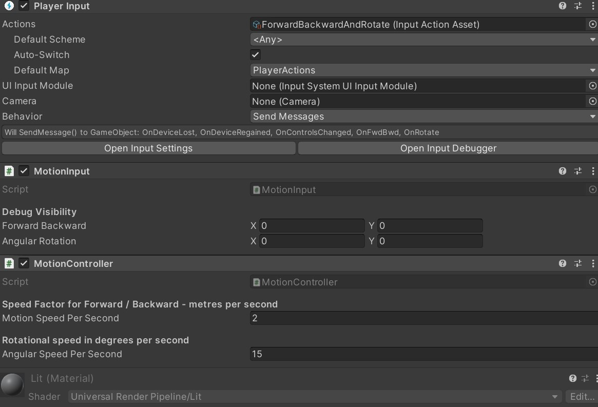
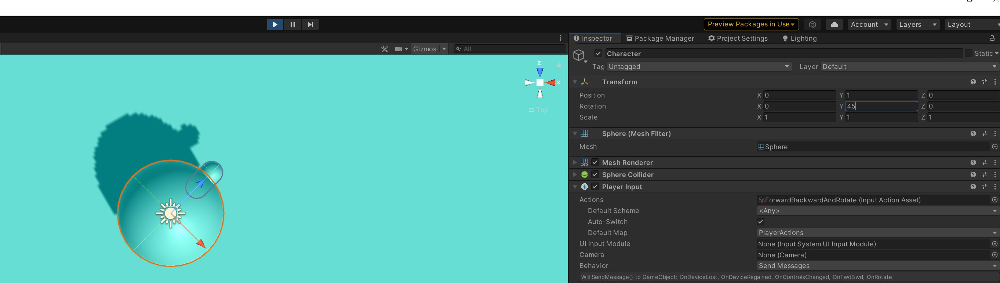
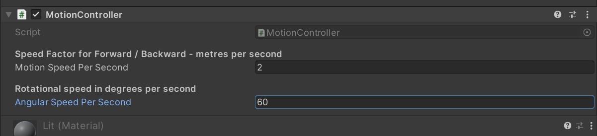

# Extend MotionInput and Add MotionController

This should not be as tedious as the previous page. The detail and images
were necessary to help with the Input System Input Action asset and the
tricks on how to configure this for two vector type inputs that make sense
for motion. Now, let's go to the next step of making the Character move.

## 1. I will setup a new source folder

You don't need to do this, but I do this to show the difference from
page 03, where we first create and debug the MotionInput component
and to this page where we extend it and add a new component.

I have copied the `MotionInput.cs` file to the new folder `04-extend-motioninput-and-add-controller`
and changed the filename and the class name to `MotionInputExtended` so it is obvious
and does not clash with the first example. C# files and classes must be unique
in Unity (or be in a unique namespace).

## 2. Create a C# source file for the MotionController

By right clicking on the source folder in the Project window and select Create | C# Script,
and give it the name `MotionController` and we will have a file with the standard Unity
C# MonoBehaviour derived class template.

## 3. Add Attributes to MotionController

Like before, let's add some attributes:
- `AddComponentMenu`
- `RequireComponent`

The class declaration should look like this now:

```C#
[AddComponentMenu("InputExample/" + nameof(MotionController))]
[RequireComponent(typeof(MotionInput))]
public class MotionController : MonoBehaviour
```

---------------------------------------

NOTE: You might be wondering why I use the `nameof` operator on the class
name instead of put the class name in the string. This makes it consistently
refactor proof, if I rename the class.

The `AddComponentMenu` attribute is not necessary but makes it so much easier
to find your custom components and separates it from all the others.

---------------------------------------

## 4. Get a reference to MotionInputExtended

The reason we made the `MotionInput` component required is to make sure that
the Character will have both. The controller needs the input to change the position
of the character to achieve motion.

Add a private field for the motion input extended reference and initialize it in Start().
We will do the same for the Transform component. Yes, every MonoBehaviour has a `transform`
property but this code is terribly inefficient so I get a proper reference and cache it
in a private reference. The body of the class now has the following.

```C#
  private MotionInput _Input;
  private Transform _Transform;

  void Start()
  {
      _Input = GetComponent<MotionInput>();
      _Transform = GetComponent<Transform>();
  }
```

## 5. Add some customizable speed multipliers

I add two floats and give them headers that will appear in the inspector to explain
their purpose. I insert these public values before the private references so the class
body starts like this...

```C#
public class MotionController : MonoBehaviour
{
    [Header("Speed Factor for Forward / Backward - metres per second")]
    public float _MotionSpeedPerSecond = 2.0f;

    [Header("Rotational speed in degrees per second")]
    public float _AngularSpeedPerSecond = 15f;

    private MotionInputExtended _Input;
```

## 6. Make a method to update forward / backward translation

We create a private method called `MoveForwardBackward` to multiply the forward/backword
motion vector Y component from the `MotionInput` component with the `_MotionSpeedPerSecond` value
and perform translation along the Z direction that the character is facing. We will
also use `Time.deltaTime` to make motion smooth and to convert units from metres / frame to
metres / second.

Only the Y part of the vector is needed because the `w` and `s` keys only affect the
Y component - Up and Down.

We add a call to this method to the `Update()` method.

```C#
  void Update()
  {
      MoveForwardBackward();
  }

  private void MoveForwardBackward()
  {
      float zPosDelta = _Input._ForwardBackward.y * _MotionSpeedPerSecond * Time.deltaTime;
      _Transform.Translate(0, 0, zPosDelta);
  }
```

## 7. Add components to the Character

Now our scene already has the `Player Input` and the `MotionInput` components from the previous
debugging. Let's add the `MotionController` component to the Character and test it.

In the Inspector click [Add Component] button | InputExample | MotionController

You can tune the forward backward motion but the default value of 2 should be ok.
Click Play and see what happens.



`MotionInput` will still be debugging - you can remove those lines of code if you like.

If you try different values in the property for Motion Speed Per Second, in the Inspector, you
should see the character speed change accordingly.

While Playing, try changing the Y rotation in the Inspector Y rotation to test that
the translation in Z is going to work in different cases as we rotate the character.



In this image, I have the scene camera looking down from above. Rotating around the Y axis
means it is looking 45 degress to its right. Now when pressing `W` and `S` we should see
the character move forward or backward along the direction it is looking.

## 8. Make a method to rotate the character around Y axis.

Let's add the ability to rotate to the character...

Create a private method called `RotateAroundYAxis` that will taking the X part of `_AngularRotation` vector from the `MotionInput` component and multiply it by the angular rotation
speed and by `Time.deltaTime` so the motion is smooth and the speed is in the units 
of degrees / second. We take this value and use the Transform's `Rotate` method to rotate around Y.

We need to call this method from the `Update()` method.

With the additional `RotateAroundYAxis` method the additional call in the `Update()` method,
we end up with the following code snippet.

```C#
  void Update()
  {
      MoveForwardBackward();
      RotateAroundYAxis();
  }

  private void MoveForwardBackward()
  {
      float zPosDelta = _Input._ForwardBackward.y * _MotionSpeedPerSecond * Time.deltaTime;
      _Transform.Translate(0, 0, zPosDelta);
  }

  private void RotateAroundYAxis()
  {
      float angularDelta = _Input._AngularRotation.x * _AngularSpeedPerSecond * Time.deltaTime;
      _Transform.Rotate(0, angularDelta, 0);
  }
```

## 9. Debugging and Tuning

When pressing Play, we see that the rotation speed is too slow - the default was only 15 degrees
per second. Try changing this to 60 degrees per second in the Inspector and it will feel more
responsive.



This is the advantage of making speed constants editable via the Inspector Window.

--------------------------------------------------------

The final source file for `MotionController` is in the `src` folder.
See: [MotionController.cs](../src/04-extend-motioninput-and-add-controller/MotionController.cs)


This is the end of the basic Quick Start.
