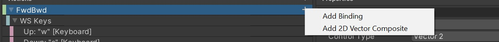
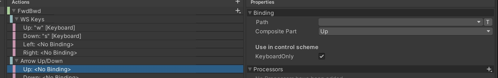
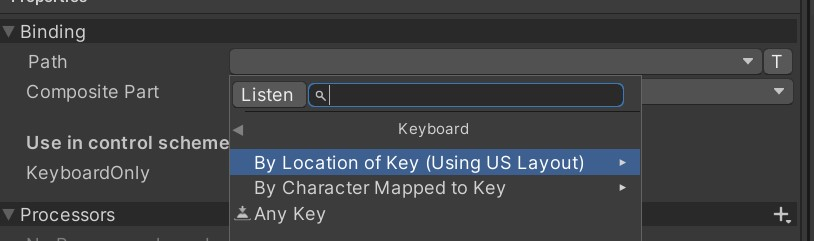
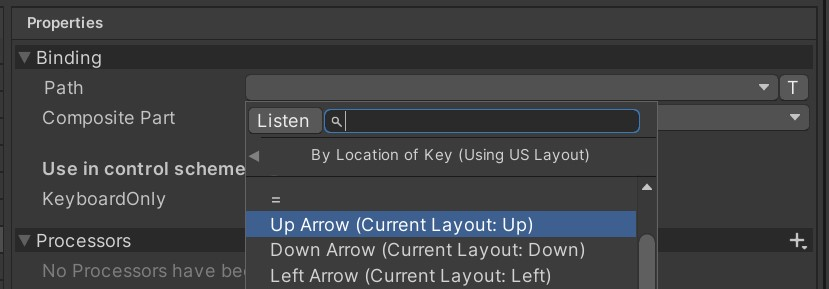
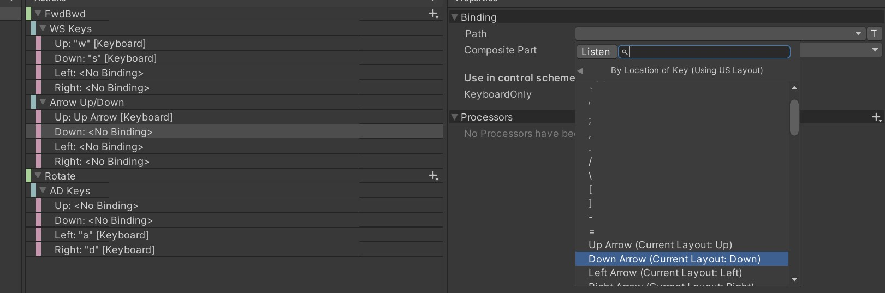
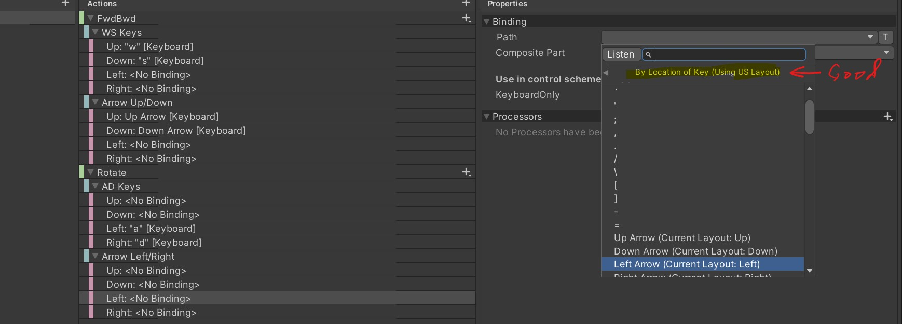
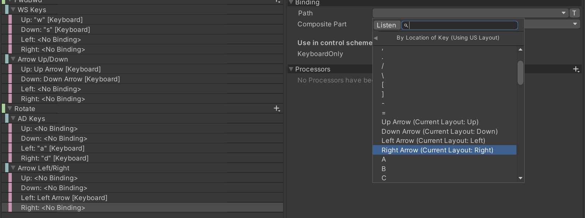

# Adding Arrow Keys

The Input Action asset created in section 03 only supports
`W` and `S` keys for Up/Down and `A` and `D` keys for left/right.

Let's go through a process of adding an additional key mapping.

## Concept

This should not need a lot of change to the existing ForwardBackward asset
file.

In theory, we just need to create new Vector Composites for the `FwdBwd` action
and for the `Rotate` action and give the new composites key bindings for the
corresponding arrows.

### 1. Adding a new vector composite to FwdBwd

Add a 2D Vector composite, which creates a composite binding and call it `Arrow Up/Down`
by clicking on the **+** key with the pull-down chevron that is on the end of `FwdBwd`.

### 2. Set Up binding to Up Arrow

Select the Up binding from the `Arrow Up/Down` composite and see the Properties panel
on the right.

Now click on the Path property pull-down and navigate to the up arrow key.
The mechanism we used before seems to only assign regular visible characters, like "W"
but not keyboard special keys, like an arrow key.

So we navigate the Path back until we see Keyboard path types and can choose
"By Location of Key (Using US Layout)":

Now we can choose By Location of Key | Arrow Up Key.

### 3. Set Down arrow binding

Select the Down binding and click on Path to find Down Arrow Key.
This time around, we should still see binding options for the "By Location of Key" 
sub-menu.

## Now Our Up/Down arrows are mapped

I did a test run at this point to see that Arrow keys made the character move
forward and backward. It works!! ... Oh me of little faith!

## Finishing the Bindings

Enough play testing, let's finish the Left/Right bindings.

### 4. Setting Left/Right arrows on the Rotate Action

Add a "2D Vector Composite" to the Rotate Action by clicking on the `+` pull-down menu at the
end of the `Rotate` action item and call it `Arrow Left/Right` and our key mappings will appear under this.

### 5. Set Left Arrow binding

Select the `Left: ` binding and in the Properties pane, click on Path and make sure
we are using the "By Location of Key" association.

***NOTE***: See at the top of the above image how the `Path` property shows that it is
in the "By Location of Key" section... and that's why we have Arrow key options available.

### 6. Set Right Arrow binding

Select the `Right: ` binding from the Action pane and click on the `Path` property in the
Properties pane to choose Right arrow key. You may need to scroll to find the Right arrow
key option.

## Should be done now

Now, we should be able to use **WASD** or **Arrow Keys** to control the character equally well.
And that's exactly what happened! So it works.

----------------------------------------------------------------------

**NEXT**:  [Add PS4 Dual Shock Controller support.](./06-ps4-controller.md)