# Time for PS4 Controller Input

Let's try adding a new input device - the PS4 controller via USB
Assuming you have a PS4 controller and micro USB to USB-A cable
lying around.

They way I'm going to do this is to duplicate the Input Action asset
in the `Project` window by selecting the asset and hitting CTRL-D (or
you can use right-click menu as well). Then I rename the duplicate
to `ForwardBackwardAndRotate-kb-and-ps4` and I will edit this
version of the asset to add PS4 support. I will save a copy
in the [asset-for-ref](../asset-for-ref) folder.

### Using Left and Right Joystick

This is an exercise in mapping Joysticks and Action events as desired.
We will link Up/Down from the Left joystick of the controller to `FwdBwd`
and we will link Left/Right from the Right joystick to `Rotate` and this
will help us get experience mapping different parts of a controller
to different actions.

To do this, care will be needed when navigating through the `Path` property
of bindings to make sure we are selecting the correct "Stick" as they call it.

## 1. Add New Control Scheme

1. Add new control scheme and call it "PS4 Controller"
We need to go to the top-left `All Control Schemes` pull down menu and select
"Add New Conrol Scheme..." and call it "PS4 Controller."

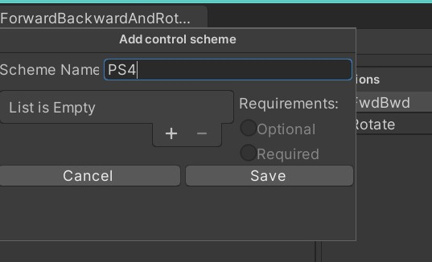

And then click Save so it is easy to edit.

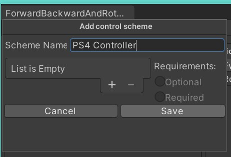

2. Add input device to the control scheme - gamepad
Go to the Control Scheme pull-down menu (top-left) and click "Edit Control Scheme" with
`PS4 Controller` control scheme selected. Then add an input device by clicking on the
 `+` button where it says "List is Empty" and choose "Gamepad"

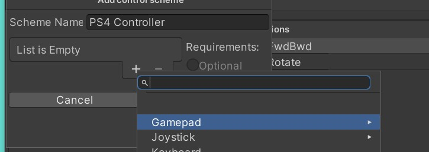

And then navigate to "PS4 Controller"

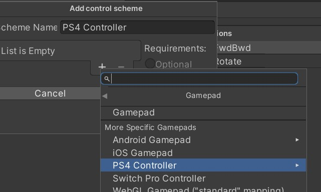

And then choose `PS4 Controller` and AVOID the "iOS DualShock" entry
I tried that one by accident first time and it does not work on PC / Windows
(probably should not be suprised). Funny thing is I thought the "PS4 Controller"
item was a heading, not an option. Click `PS4 Controller` and don't
be silly like me - it's an option and not a heading, yay!

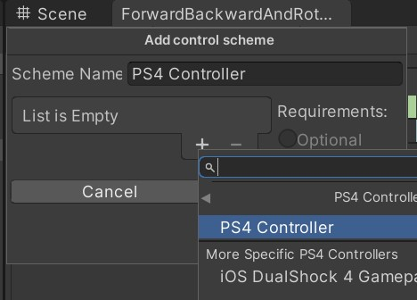

And then click `Save` to save your updated Control Scheme.
This should be enough to add new bindings to the existing actions.

----------------------------------------------------

***NOTE*** : You can select a control scheme and this filters the view
and that makes it easier to edit one control scheme without the noise
from others getting in the way.

You can choose "All Control Schemes" if you want to see all the bindings
at once. Here you can see the control scheme pull-down menu 
has "PS4 Controller" selected, so the bindings are filtered. Notice
the Action don't have `>` expandable binding lists next to them? That's
because the keyboard bindings are filtered out.

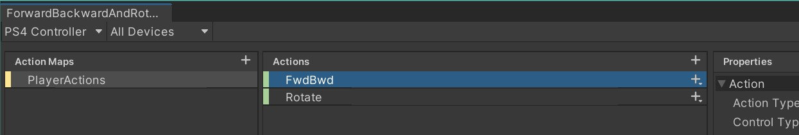

If I choose "All Control Schemes" by clicking on the control scheme drop-down
menu and select "All Control Schmes" like this...

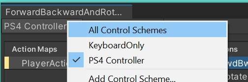

And now all the keyboard bindings are visible again (they are collapsed under the 2D Composites)...

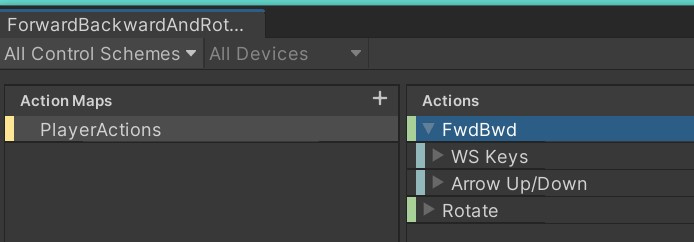

----------------------------------------------------

## 2 Add FwdBwd left joystick Up/Down bindings.

I will keep the control scheme filtered to "PS4 Controller" to keep it all simple
while editing - should make screen shots simpler, too.

Like before we need to start by adding a "2D Vector Composite" binding and then map
the Up and Down event bindings.

1. Click on Action pull down menu at the end and choose "Add 2D Vector Composite"
and call it "LeftJoy"

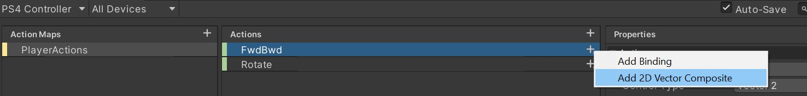

2. Add the Up binding to LeftJoy

With the `Up:` binding from `LeftJoy` selected, click on `Path` in the Properties pane
and navigate down the Gamepad menu to Left Stick | Up.

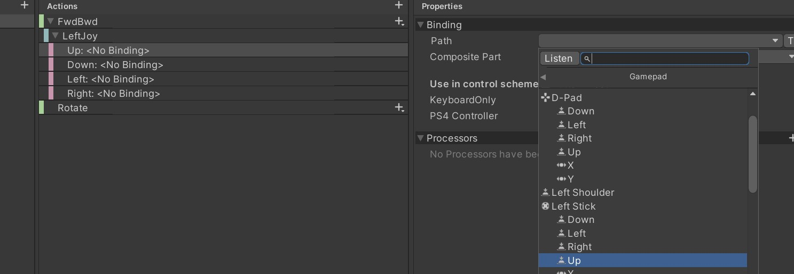

3. Add the Down binding to LeftJoy

Similar to before, with `Down:` binding from `LeftJoy` selected, click on `Path` and 
navigate the Gamepad menu to Left Stick | Down.

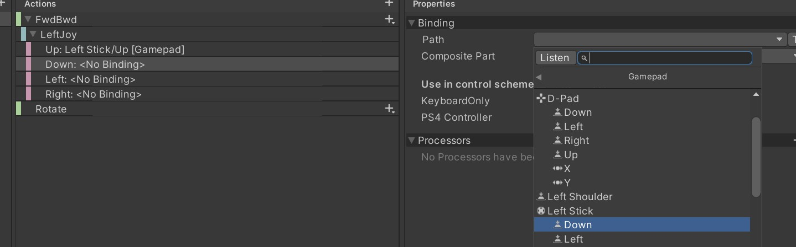

-----------------------------------------------------------------------------

## 3 Add Rotate right joystick left/right bindings

1. On pull-down menu at the end of the Rotate Action, click "Add 2D Vector Composite"
and call this "RightJoy"

2. Select 'Left:' binding and click Path property.

Make sure the `Left:` binding under `RightJoy` is selected, then navigate `Path` 
to Gamepad | Right Stick | Left

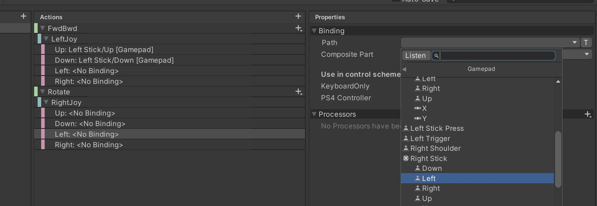

3. Select 'Right:' binding

Make sure the `Right:` binding under `RightJoy` composite is selected, then navigate
`Path` to Gamepad | Right Stick | Right.

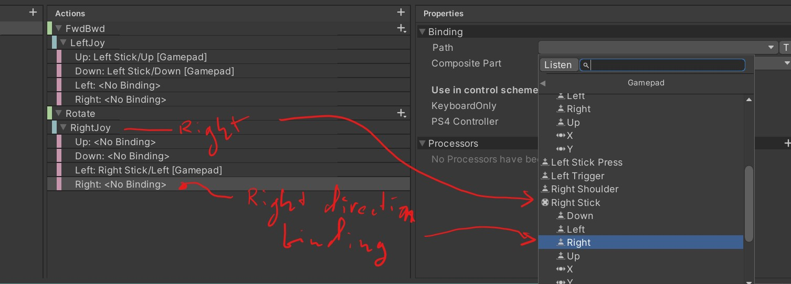

-----------------------------------------------------------------------------

## 4 Testing the new mappings

Remember at the start that I duplicated the original `ForwardBackwardAndRotate` asset
and called the copy `ForwardBackwardAndRotate-kb-and-ps4` and that's what I edited...
Now I need to select this in the Character's `Player Input` component so the input
bindings will be used.

1. Set `Player Input` Input Actions asset to `ForwardBackwardAndRotate-kb-and-ps4`

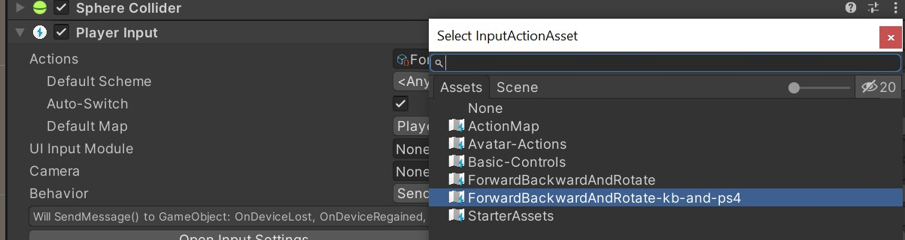

2. Plug in a PS4 controller (if you can / have it)

3. Press PLAY and let's see if we can use the controller and the keyboard.

As long as you chose the "PS4 Controller" Gamepad item (like I did, eventually),
then it should all work. You should still see debug messages be generated
by the `MotionInput` component when using the PS4 left and right sticks.

----------------------------------------------------------------------

**THAT'S ALL FOR NOW**